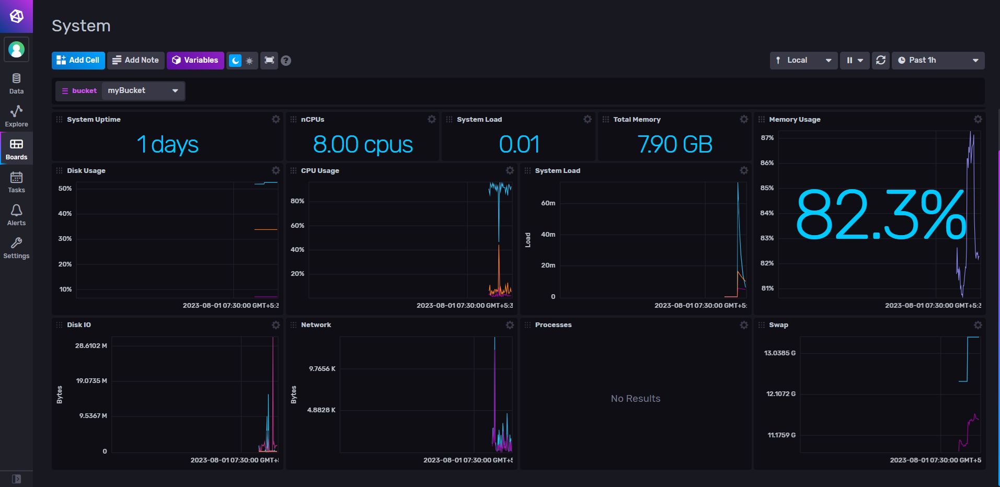

# Project Overview
This project employs Spring Boot for implementing REST API and MySQL as the database.
The database table is named products and has 3 tables: Product, Customer, Orders. 

The schemas are as follows:
```
Product table:
prod_id: SERIAL (Primary Key)
name: VARCHAR(50)
price: FLOAT
quantity: INT
```

```
Customer table:
cust_id: SERIAL (Primary Key)
name: VARCHAR(50)
email: VARCHAR(50)
```

```
Orders table:
id: SERIAL (Primary Key)
cust_id: INT (Foreign Key)
products: TEXT (comma separated string containing product ids customer ordered)
quantity: TEXT (comma separated string containing quantities of products purchased)
price: FLOAT (total price of order)
```

The backend contains model for these 3 tables and their respective controllers to view, add, update orders, customers and products.

## Running Telegraf service instance
Run the following command to start telegraf service in terminal or powershell:
```
.\telegraf.exe --service start
```

## Setting up InfluxDB
Start the influx UI by running ```./influxd``` in the terminal.

Sign in to influx and load data using telegraf.

Telegraf config file is below:
```
[agent]
  interval = "10s"
  round_interval = true

  metric_batch_size = 1000

  metric_buffer_limit = 10000

  collection_jitter = "0s"

  flush_interval = "10s"
  flush_jitter = "0s"

  precision = ""

  debug = false
  quiet = false
  logfile = ""

  hostname = ""
  omit_hostname = false
[[outputs.influxdb_v2]]	
  urls = ["http://localhost:8086"]

  token = "$INFLUX_TOKEN"

  organization = "Personal"

  bucket = "myBucket"
[[inputs.cpu]]
  percpu = true
  totalcpu = true
  collect_cpu_time = false
  report_active = false
[[inputs.disk]]
  ignore_fs = ["tmpfs", "devtmpfs", "devfs"]
[[inputs.diskio]]
[[inputs.mem]]
[[inputs.net]]
[[inputs.processes]]
[[inputs.swap]]
[[inputs.system]]
```



I've built a new bucket named "myBucket" in InfluxDB which is integrated to Grafana later on.

## Setting up Grafana
After setting up with InfluxDB and Telegraf, now run ```grafana-server.exe``` from the terminal and go to ```localhost:3000```. Sign in and create new data source with inlfuxdb and fill out the details and view the analytics.